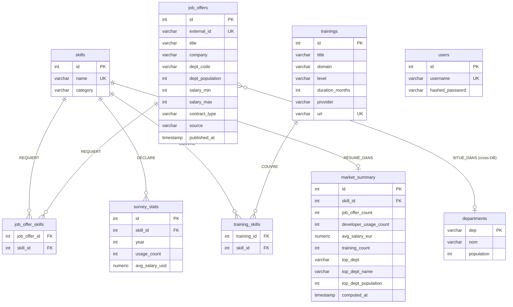

# SkillWatch — Modélisation Merise

## Contexte

SkillWatch est un observatoire du marché de l'emploi Data & IA en France. Il agrège des données
hétérogènes (offres d'emploi, enquêtes développeurs, formations, démographie) pour identifier les
compétences les plus demandées et les mieux rémunérées. L'architecture repose sur deux instances
PostgreSQL distinctes : `skillwatch_db` (port 5432) pour la base analytique finale, et
`demographics_db` (port 5433) pour les données INSEE externes.

---

## MCD — Modèle Conceptuel de Données

### Entités et attributs

```
SKILL
- id (identifiant)
- name
- category

JOB_OFFER
- id (identifiant)
- external_id
- title
- company
- location
- dept_code
- dept_population
- salary_min
- salary_max
- contract_type
- source
- published_at

SURVEY_STAT
- id (identifiant)
- year
- usage_count
- avg_salary_usd

TRAINING
- id (identifiant)
- title
- domain
- level
- duration_months
- provider
- url

MARKET_SUMMARY
- id (identifiant)
- job_offer_count
- developer_usage_count
- avg_salary_eur
- training_count
- top_dept
- top_dept_name
- top_dept_population
- computed_at

DEPARTMENT  [demographics_db]
- dep (identifiant)
- nom
- population

USER
- id (identifiant)
- username
- hashed_password
```

### Relations et cardinalités

```
SKILL (0,N) ——— REQUIERT ——— (0,N) JOB_OFFER
  Un skill est requis par 0 à N offres d'emploi
  Une offre d'emploi requiert 0 à N skills
  → table d'association : job_offer_skills

SKILL (0,N) ——— DÉCLARE ——— (1,1) SURVEY_STAT
  Un skill a 0 à N statistiques (une par année de sondage)
  Une statistique annuelle concerne exactement 1 skill

SKILL (0,N) ——— COUVRE ——— (0,N) TRAINING
  Un skill est couvert par 0 à N formations
  Une formation couvre 0 à N skills
  → table d'association : training_skills

SKILL (0,1) ——— RÉSUMÉ_DANS ——— (1,1) MARKET_SUMMARY
  Un skill a 0 ou 1 résumé de marché
  Un résumé de marché concerne exactement 1 skill

JOB_OFFER (0,N) ——— SITUÉ_DANS ——— (0,1) DEPARTMENT
  Un département contient 0 à N offres d'emploi
  Une offre est localisée dans 0 ou 1 département
  → jointure logique via dept_code / dep (cross-DB, réalisée en Python)

USER
  Entité autonome sans association — utilisée uniquement pour l'authentification API
```

---

## Justifications de modélisation

### Pourquoi deux tables d'association N-N

`job_offer_skills` et `training_skills` existent parce que les associations entre SKILL et
JOB_OFFER d'une part, et entre SKILL et TRAINING d'autre part, sont toutes deux de cardinalité
(0,N)-(0,N) : une offre peut exiger plusieurs compétences (Python, SQL, Spark), et une même
compétence apparaît dans de nombreuses offres. De même, une formation couvre plusieurs skills,
et un skill est enseigné dans plusieurs formations. Ce modèle N-N ne peut pas être représenté
sans table intermédiaire sans dénormalisation ou perte d'intégrité référentielle.

### Pourquoi MARKET_SUMMARY est une table et pas une vue

Les agrégats (nombre d'offres, salaire moyen, usage développeurs, département dominant) sont
calculés en batch par le pipeline de transformation (Spark + pandas), puis persistés via un
upsert. Recalculer ces valeurs à chaque requête API nécessiterait des jointures coûteuses sur
plusieurs tables. La table matérialisée garantit des temps de réponse constants indépendamment
du volume de données brutes. La colonne `computed_at` permet de tracer la fraîcheur des données.

### Pourquoi deux instances PostgreSQL distinctes

`skillwatch_db` (port 5432) est la base analytique finale : elle contient toutes les données
transformées et normalisées par le pipeline ETL. `demographics_db` (port 5433) héberge les
données démographiques INSEE (population par département) issues d'un dump externe. Cette
séparation respecte le principe de séparation des responsabilités : la base source n'est jamais
modifiée par le pipeline, elle est uniquement lue. PostgreSQL ne permettant pas les Foreign Keys
inter-bases, la jointure entre `job_offers.dept_code` et `departments.dep` est réalisée en
mémoire dans le service Python (`market_service.py`).

### Pourquoi PostgreSQL

Le modèle relationnel de PostgreSQL permet d'exprimer les contraintes d'intégrité nécessaires :
clés primaires, `UNIQUE` sur `skills.name`, `survey_stats(skill_id, year)` et `market_summary.skill_id`,
cascades sur suppression (`ON DELETE CASCADE`). Les transactions ACID garantissent la cohérence
des upserts batch. PostgreSQL est nativement compatible avec SQLAlchemy (ORM et `text()` raw),
ce qui facilite l'intégration avec FastAPI.

---

## MPD — Modèle Physique de Données

### skillwatch_db (port 5432)

| Table | Clé primaire | Clés étrangères | Contraintes UNIQUE |
|---|---|---|---|
| `skills` | `id` SERIAL | — | `name` |
| `job_offers` | `id` SERIAL | — | `external_id` |
| `job_offer_skills` | (`job_offer_id`, `skill_id`) | `job_offer_id` → `job_offers.id` CASCADE, `skill_id` → `skills.id` CASCADE | — |
| `survey_stats` | `id` SERIAL | `skill_id` → `skills.id` CASCADE | (`skill_id`, `year`) |
| `trainings` | `id` SERIAL | — | `url` |
| `training_skills` | (`training_id`, `skill_id`) | `training_id` → `trainings.id` CASCADE, `skill_id` → `skills.id` CASCADE | — |
| `market_summary` | `id` SERIAL | `skill_id` → `skills.id` CASCADE | `skill_id` |
| `users` | `id` SERIAL | — | `username` |

### demographics_db (port 5433)

| Table | Clé primaire | Clés étrangères | Contraintes UNIQUE |
|---|---|---|---|
| `departments` | `dep` VARCHAR(10) | — | — |

> `departments.dep` est une clé primaire de type VARCHAR (code département INSEE : `"75"`, `"2A"`, etc.).

---

## Diagramme Mermaid



> La relation `SITUÉ_DANS` entre `job_offers` et `departments` est une jointure **logique uniquement** :
> aucune Foreign Key physique ne peut exister entre deux bases PostgreSQL distinctes.
> La résolution est faite en mémoire dans `market_service.py`.

---

## Conformité RGPD

Le projet SkillWatch ne traite aucune donnée personnelle nominative au sens du Règlement (UE)
2016/679 (RGPD), Considérant 26 : *"les données à caractère anonyme, c'est-à-dire les
informations ne concernant pas une personne physique identifiée ou identifiable [...] ne sont pas
soumises au présent règlement"*.

- **Stack Overflow Survey** : chaque répondant est identifié par un `ResponseId` anonyme et
  aléatoire ; aucun nom, email ou identifiant persistant n'est conservé.
- **France Travail** : les offres d'emploi contiennent des données d'entreprises (raison sociale,
  localisation) et non des données de candidats ou de personnes physiques.
- **OpenClassrooms** : données publiques de formations (titres, domaines, durées) sans aucune
  donnée d'apprenant.
- **INSEE** : données démographiques agrégées par département (code + nom + population totale) —
  aucune granularité individuelle.

La table `users` stocke uniquement des identifiants d'administrateurs techniques avec mot de
passe hashé (Argon2). Elle ne constitue pas un traitement de données personnelles à grande
échelle et reste hors périmètre d'un registre de traitements.
